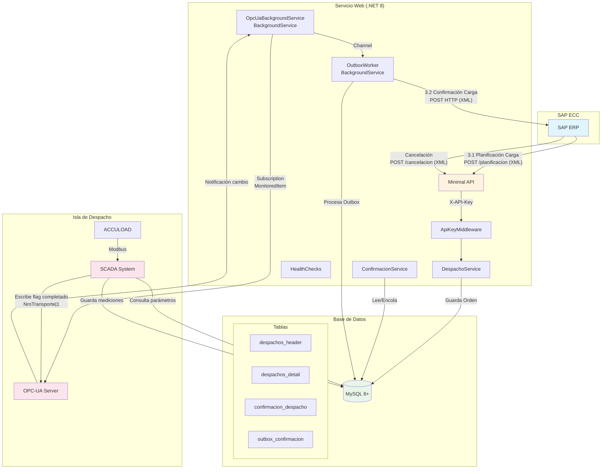
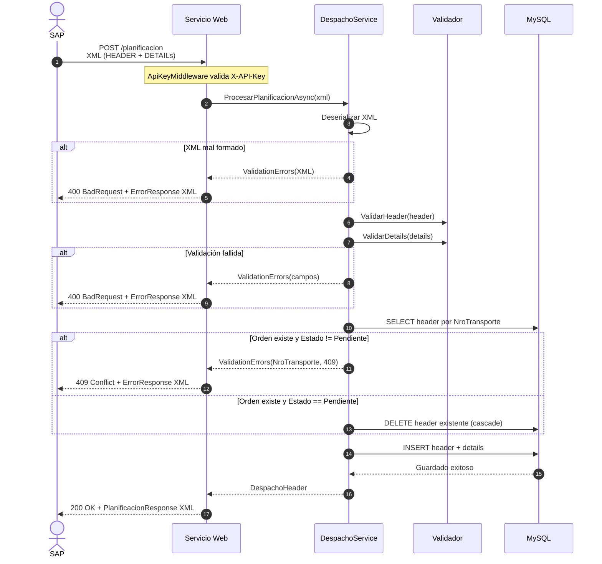
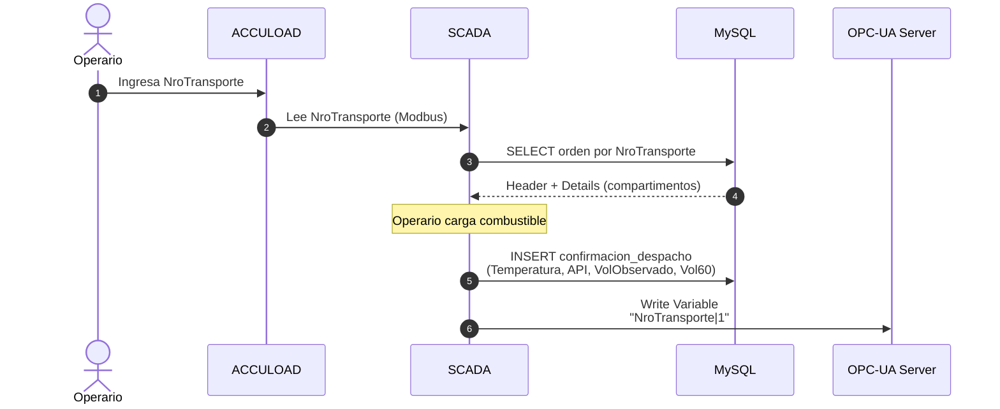
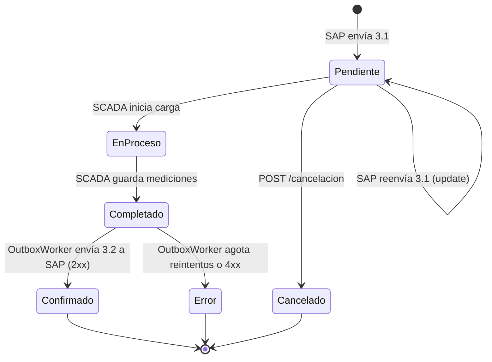
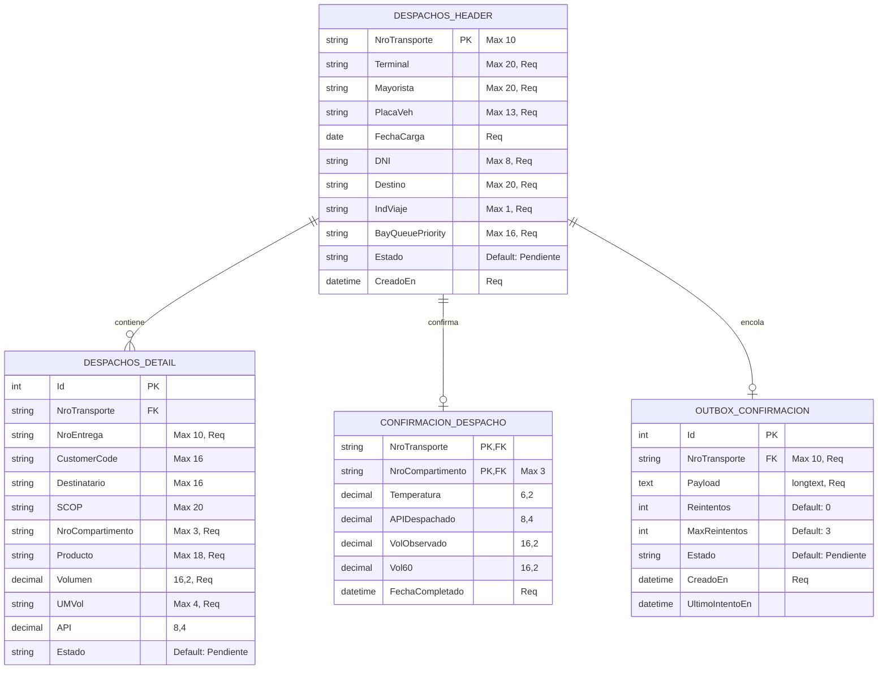
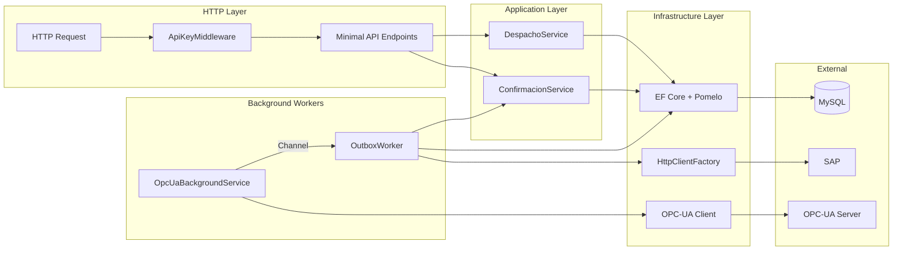

# Arquitectura y Flujo de Información - Despachos Petroperú

## 1. Vista de Componentes



---

## 2. Flujo de Planificación de Carga (Interfaz 3.1)



---

## 3. Flujo en Isla de Despacho (SCADA)



---

## 4. Flujo de Confirmación de Carga (Interfaz 3.2)

```mermaid
sequenceDiagram
    autonumber
    participant OPCS as OPC-UA Server
    participant OPC as OpcUaBackgroundService
    participant CH as Channel&lt;string&gt;
    participant OW as OutboxWorker
    participant CS as ConfirmacionService
    participant DB as MySQL
    participant SAP as SAP

    Note over OW: Startup Scan
    OW->>CS: ObtenerCompletadosPendientesAsync()
    CS->>DB: SELECT headers Estado=Completado<br/>sin outbox Estado=Enviado
    DB-->>CS: Lista NroTransportes
    loop Por cada pendiente
        OW->>CS: ProcesarDespachoCompletadoAsync(nro)
        CS->>DB: SELECT header + details + confirmaciones
        CS->>DB: INSERT outbox_confirmacion (payload XML)
        CS->>DB: UPDATE header Estado = Completado
    end

    Note over OPCS,CH: En caliente (subscription)
    OPCS->>OPC: Notification: "NroTransporte|1"
    OPC->>OPC: ParseNroTransporte()
    OPC->>CH: TryWrite(nroTransporte)
    CH->>OW: ReadAsync()
    OW->>CS: ProcesarDespachoCompletadoAsync(nro)
    CS->>DB: INSERT outbox_confirmacion
    CS->>DB: UPDATE header Estado = Completado
    OW->>DB: SELECT outbox Estado=Pendiente
    loop Por cada outbox pendiente
        OW->>SAP: POST Confirmación XML<br/>X-API-Key
        alt 2xx Success
            SAP-->>OW: 200 OK
            OW->>DB: UPDATE outbox Estado=Enviado
            OW->>DB: UPDATE header Estado=Confirmado
        else 5xx / 429
            OW->>OW: Backoff (10s/30s/60s)<br/>Reintentos++
            alt Reintentos < 3
                OW->>SAP: Reintento
            else Agotado
                OW->>DB: UPDATE outbox Estado=Error
            end
        else 4xx Client Error
            OW->>DB: UPDATE outbox Estado=Error
        end
    end
```

---

## 5. Ciclo de Vida de la Orden de Despacho



---

## 6. Modelo de Datos (ERD)



---

## 7. Arquitectura Interna del Servicio Web



---

## 8. Decisiones Clave de Arquitectura

| # | Decisión | Descripción |
|---|----------|-------------|
| 1 | **MySQL única** | Compartida entre Servicio Web y SCADA. Ambos leen/escriben la misma BD. |
| 2 | **OPC-UA solo para confirmación** | Sentido SCADA → Servicio Web únicamente. No se notifican nuevas órdenes vía OPC-UA. |
| 3 | **Subscription OPC-UA** | `MonitoredItem` con `PublishingInterval=1000ms`, no polling. |
| 4 | **Síncrono SAP inbound** | SAP espera respuesta HTTP al enviar 3.1. |
| 5 | **Outbox pattern** | Tabla `outbox_confirmacion` con reintentos (3 intentos, backoff 10s/30s/60s). |
| 6 | **Autenticación API Key** | SAP inbound/outbound usan `X-API-Key`. OPC-UA usa user/password. |
| 7 | **Idempotencia** | Duplicado de SAP en estado `Pendiente` hace update; en otros estados devuelve 409. |
| 8 | **Startup degradado** | Si OPC-UA no está disponible, el servicio acepta órdenes e intenta reconectar cada 30s. |
| 9 | **Graceful shutdown** | Drain del worker outbox (timeout 30s). Pendientes en memoria se recuperan vía startup scan. |
| 10 | **Confirmación idempotente** | HTTP 2xx = `Confirmado`, 4xx = `Error`, 5xx = reintento. |

---

## 9. Formato Variable OPC-UA

```
ns=2;s=Despachos.Completados
Valor: "{NroTransporte}|1"
```

Ejemplo: `"T001234567|1"`

El servicio parsea el valor, extrae el `NroTransporte` y lo encola en un `Channel<string>` para procesamiento por el `OutboxWorker`.

---

## 10. Endpoints REST

| Método | Ruta | Descripción | Auth |
|--------|------|-------------|------|
| POST | `/planificacion` | Recibe Interfaz 3.1 de SAP | X-API-Key |
| POST | `/cancelacion` | Cancela orden en estado Pendiente | X-API-Key |
| GET | `/health` | Health checks (MySQL, OPC-UA, Outbox) | - |
| GET | `/health/ready` | Readiness probe | - |
| GET | `/health/live` | Liveness probe | - |
